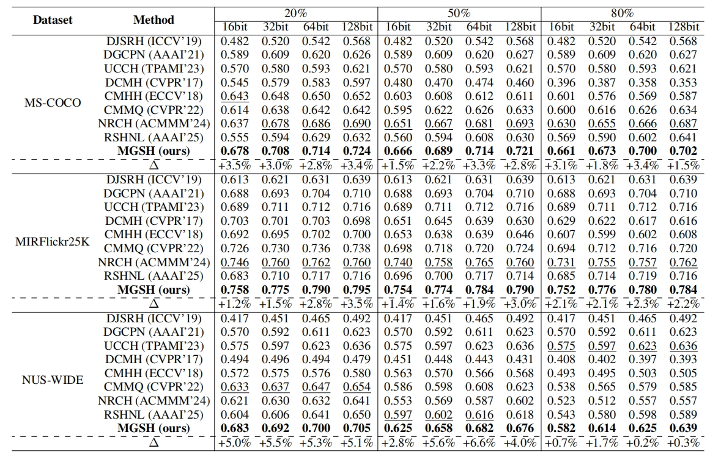

## Meta-Guided Sample Reweighting for Robust Cross-Modal Hashing Retrieval with Noisy labels

PyTorch implementation for Meta-Guided Sample Reweighting for Robust Cross-Modal Hashing Retrieval with Noisy labels. (AAAI 2026)

## MGSH framework

Overview of the MGSH framework. The framework consists of three main components: (1) Feature Extraction: A dual-stream encoder processes training and meta samples to obtain modality-specific representations. (2) Bi-level Network Architecture: Based on the meta-importance weights, the main model **$\mathcal{F}_{\Theta}$** computes a robust hashing loss function, while the meta model **$ \mathcal{G}_{\Phi} $**reweights the samples and provides the updated weights to the main model. (3) Meta Pipeline: The meta-learning process updates the parameters of both models, enabling robust sample reweighting and adaptive margin adjustment.


## Train with Our Model

To set up the running environment, first create and activate the Python environment, then install all required dependencies:

```bash
conda create -n MGSH python=3.10
conda activate MGSH
pip install -r requirements.txt
```


Next, preprocess the dataset to generate the .h5 file and add noise. This can be done by running the following scripts:

```bash
python ./utils/tools.py
python ./noise/generate.py
```
Then in our model, we split a small meta-clean dataset from the `.h5` file :

```bash
python ./meta/generate_meta.py
```

You can set `META_RATE` to change the meta-dataset size to train meta-network.

Once the `.h5` file and noise are generated, you can run the main script `MGSH.py` for MIRFlickr-25K dataset under 50% noise rate by default parameter settings in our code:

```bash
python MGSH.py
```
You can download MIRFlickr-25K dataset dataset from [here](https://drive.google.com/drive/folders/1GBMOXKT3lkb0mVFJ1nEozccnC-cGz_wb).

## Experiment Results:

